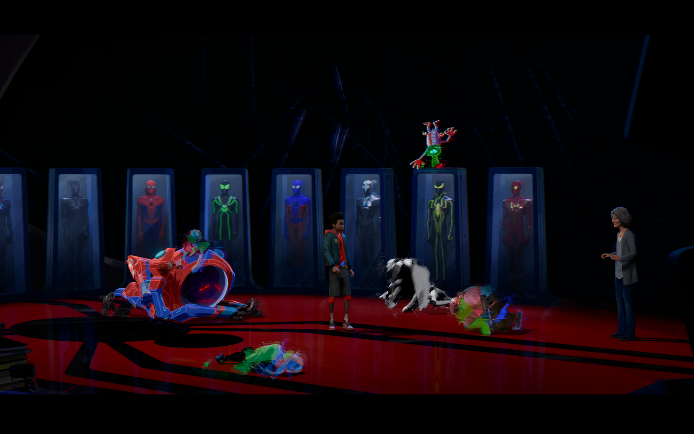
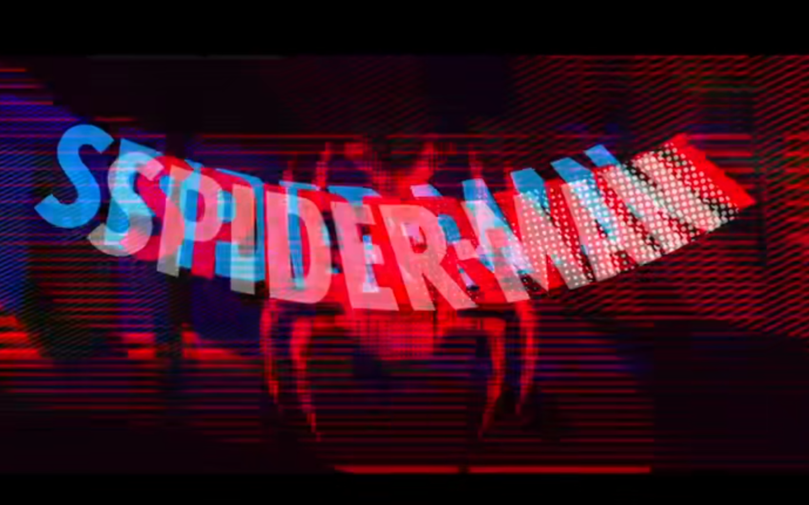

# ltan0456_9103_tut5

## Part 1: Imaging Technique Inspiration

**Glitch Art**

Glitch Art is an art form that simulates electronic display errors, also known as glitches, for aesthetic purposes. This effect often appears in technology-inspired visuals to express instability or distortion of dimensions. For instance, in the film 'Spider-Man: Into the Spider-Verse', it is used to depict characters from alternate universes appearing in a visually “incorrect” state (Figure 1). This imaging technique can add a strong sense of technology and sophistication to the visuals, as seen in the text transition in Figure 2.

Figure 1

Figure 2

## Part 2: Coding Technique Exploration

- Glitch Effect

Source: https://youtu.be/9CCkp_El1So?si=PyC48HjNh5TFTGTq

This coding example demonstrates how to create a text glitch effect on a website using HTML and CSS, with interactive distortion triggered when the mouse hovers over the text.

- Others

Source: https://youtu.be/qlfh_rv6khY?si=cLsyihG4btyAHpQj

This example is not directly related to the glitch effect but is intriguing—it uses programming to simulate the movement patterns of living organisms.

